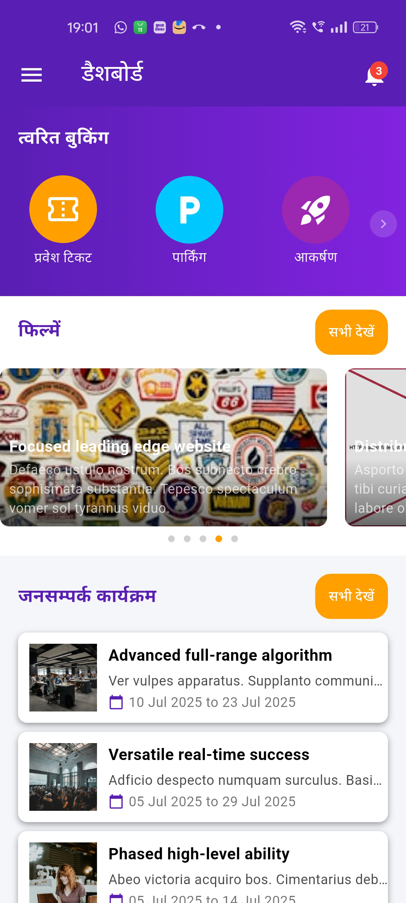
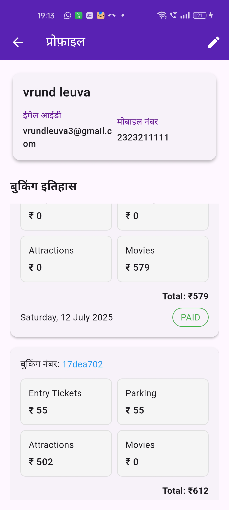

<p align="center">
  
</p>

<h1 align="center">🎟️ TicketEase</h1>

<p align="center"><em>“Your one-stop multilingual ticket booking platform for the real world.”</em></p>

<p align="center">
  
  
  
  
  
</p>

---

## 📘 Table of Contents  
> Fast navigation for explorers

- [🎯 Overview](#-overview)
- [🚀 Features](#-features)
- [🧱 Tech Stack & Architecture](#-tech-stack--architecture)
- [📦 Folder Structure](#-folder-structure)
- [🧪 Testing & QA Report](#-testing--qa-report)
- [🔧 Setup Guide](#-setup-guide)
- [📸 Demo Screenshots](#-demo-screenshots)
- [🧠 Engineering Highlights](#-engineering-highlights)
- [👨‍💼 Internship Journey](#-internship-journey)
- [🔗 Explore More](#-explore-more)
- [👨‍💻 Contact](#-contact)
- [📜 License & Security](#-license--security)

---

## 🎯 Overview  
> A full-stack **mobile-first** platform to book 🎬 movies, 🅿️ parking, 🎢 attractions, and 🎫 entry tickets — **built with scalability and real-world UX** in mind.

- 🔐 OTP-based mobile login with JWT auth
- 🌐 Supports English & Hindi (i18n)
- 📲 Push & in-app notifications
- 💳 Simulated payment workflow
- 📊 Real-time dashboard insights

Designed & developed during a tech internship — **production-level quality, startup-level agility.**

---

## 🚀 Features

| 💡 Feature                | Description |
|--------------------------|-------------|
| 🔐 **OTP + JWT Auth**     | Secure, stateless login for mobile-first UX |
| 🌐 **Multilingual UI**    | English 🇬🇧 + Hindi 🇮🇳 with live language switching |
| 🎫 **Bookings**           | Movies, Attractions, Parking, Entry Tickets |
| 📲 **Push Notifications** | Firebase-powered real-time alerts |
| 🔔 **In-App Notifications** | Count, list, mark-read, clear-all |
| 💳 **Simulated Payments** | Realistic checkout flow (no gateway needed) |
| 👤 **Profile Management** | View & update profile + booking history |
| 📊 **Dashboard Insights** | Live summary cards for quick insights |

---

## 🧱 Tech Stack & Architecture

### 🧭 Frontend
- ⚡ **Flutter**: Cross-platform performance with native feel
- 🧭 **GoRouter + Provider**: Declarative routing & simple state management
- 🌍 **easy_localization**: Dynamic language switching
- 📱 **SharedPreferences + SecureStorage**: Persistent secure user data

### 🛠️ Backend
- 🚀 **Node.js + Express**: Modular, high-performance REST API
- 🧬 **Prisma ORM**: Type-safe DB access with PostgreSQL
- 🔐 **JWT + Custom OTP Auth**: Secure custom authentication

### 🔄 Rejected Alternatives
> Every choice is intentional

| ❌ Option | ✅ Chosen Instead | Reason |
|----------|------------------|--------|
| BLoC     | Provider          | Lighter and quicker for internship duration |
| TypeORM  | Prisma            | Type-safe, better DX |
| Firebase Auth | Custom OTP + JWT | Full control over auth flow |

---

## 📦 Folder Structure

TicketEase/
├── frontend_flutter/ # 📱 Flutter mobile application
│ ├── core/ # Core theme, styles, utils
│ ├── features/ # Screens & flows: bookings, dashboard etc.
│ ├── domain/ # Business logic
│ └── data/ # Services, API calls, models
│
├── backend_nodejs/ # ⚙️ Express backend
│ ├── controllers/ # API handlers
│ ├── routes/ # REST endpoints
│ ├── middleware/ # Auth, validation
│ └── prisma/ # DB schema, migrations
│
└── README.md # 📘 This file

---

## 🧪 Testing & QA Report

> ✅ Thorough testing ensures reliability

| Area                         | Status | Notes                          |
|------------------------------|--------|--------------------------------|
| 🔄 API Testing               | ✅     | Covered via Postman scripts    |
| 🧪 Backend Unit Tests        | ✅     | Using `jest` + `supertest`     |
| 🧬 UI Widget Tests (Flutter) | ✅     | Language toggle, auth screen   |
| 🧠 Edge Case Tests           | ✅     | Invalid inputs, expired OTP    |
| 🌍 i18n Language QA          | ✅     | EN ↔️ HI toggles live tested    |
| 📜 Test Docs                 | ✅     | See `TESTING.md`               |

> See detailed testing logs in [`TESTING.md`](./TESTING.md)

---

## 🔧 Setup Guide

### 🔌 Backend (Node.js + PostgreSQL)
```bash
cd backend_nodejs
cp .env.example .env
npm install
npx prisma generate
npx prisma migrate dev --name init
npm run dev

### 📱 Frontend (Flutter)
```bash
cd frontend_flutter
flutter pub get
flutter run


## 📸 Demo Screenshots
<p align="center">      </p>

## 🧠 Engineering Highlights
- 🔄 Simulated Payment: UX-first checkout simulation without external gateway
- 🌍 Live Language Toggle: Instant language switch with easy_localization
- 🔐 Custom OTP Auth: Full backend-controlled login flow
- 🧠 Modular Clean Architecture: core, features, domain, data
- 🧩 Scalable API Design: Modular routes, services, and middleware


## 👨‍💼 Internship Journey
- 🎓 Developed during internship at Silver Touch Technologies

### 📌 Challenge:
- Build a real-world mobile booking app from scratch.

### 🛠️ My Approach:
- Set up OTP + JWT Auth flow
- Implemented modular clean architecture (Flutter + Express)
- Designed UI with real-world UX in mind
- Integrated Firebase for push notifications
- Implemented i18n + language switcher
- Built reusable widgets and consistent design tokens


## 🔗 Explore More
- 📱 Frontend Guide: frontend_flutter/README.md
- ⚙️ Backend Guide: backend_nodejs/README.md
- 🧪 Test Docs: TESTING.md

## 👨‍💻 Contact
Developed by:

Vrund Leuva
📧 vrundleuva3@gmail.com
🔗 GitHub
🔗 LinkedIn


## 📜 License & Security
License: MIT — Free to use with attribution ❤️

### ⚠️ Security Best Practices
✅ .env files are git-ignored
✅ JWT secrets stored in environment variables
✅ Inputs are validated at frontend & backend
✅ No real payment gateway or sensitive user data

<p align="center"><strong>✨ Thank you for exploring TicketEase! ✨</strong></p> ```